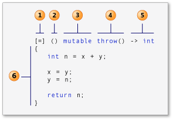

# C++

## C++ 不允许重载的运算符是？

不能重载的运算符只有5个：
.  (成员访问运算符)
.*  (成员指针访问运算符)
::  (域运算符)
sizeof  (长度运算符)
?:  (条件运算符）

前两个运算符不能重载是为了保证访问成员的功能不能被改变，域运算符和sizeof 运算符的运算对象是类型而不是变量或一般表达式，不具备重载的特征。

## C++继承: 公有, 私有, 保护

|       |public   |protected|private|
|-------|---------|---------|------|
|公有继承|public   |protected|不可见|
|私有继承|private  |private  |不可见|
|保护继承|protected|protected|不可见|

即: 派生类继承父类的成员之后, 这些成员在派生类中的访问权限

通过 `using` 和 `typedef` 可以修改派生类中基类成员的访问权限

- [C++继承：公有，私有，保护 - csqlwy - 博客园](https://www.cnblogs.com/qlwy/archive/2011/08/25/2153584.html)
- [C++继承权限和继承方式_C语言中文网](http://c.biancheng.net/cpp/biancheng/view/2984.html)
- [派生类 - cppreference.com](https://zh.cppreference.com/w/cpp/language/derived_class)
- [访问指定符 - cppreference.com](https://zh.cppreference.com/w/cpp/language/access)

## 函数指针

- 普通函数指针
    声明方式:
    ```cpp
    <返回类型> (*变量名)(参数类型列表);
    ```
    例子:
    ```cpp
    int globalFunc() {
        return 1;
    }
    int(*pgFunc)() = globalFunc;
    cout << pgFunc() << endl;	//1
    cout << pgFunc << endl;		//00B8129E
    ```

- `typedef` 简化定义
    普通指针的声明格式前加 `typedef`, `变量名` 的含义变成 `类型名`
    ```cpp
    typedef int(*FP)();
	FP fp = globalFunc;
    ```

- 静态成员函数
    声明和普通函数指针一样, 通过 `<类型>::<静态函数名>` 的方式获取静态成员函数地址
    ```cpp
    int(*pStaticBaseFunc)() = Test::staticBaseFunc;
    ```

- 类成员函数
    取地址:
    ```cpp
    int (<类型名>::*<变量名>)() = &类型名::<函数名>; //普通成员函数需要&
    ```
    使用:
    ```cpp
    (<对象变量名>.*<函数指针名>)();   //普通成员函数需要指明对象
    ```
    例子:
    ```cpp
    Test a(3);
    int (Test::*pBaseFunc)() = &Test::baseFunc; //普通成员函数需要&
    cout << (a.*pBaseFunc)() << endl;	//3, 普通成员函数需要指明对象
    cout << pBaseFunc << endl;	//1, 成员你函数得到的不是地址
    ```
    注:
    类成员函数取得的地址, 实际上并不是一个地址, 因为这个函数关联的对象还没确定, 也因此, 在使用的时候, 需要指定具体的对象

    即成员函数存在一个隐式的参数, 就是对象本身, 可以通过 `std::bind` 方法进行绑定

    使用
    ```cpp
    Test a(3);
    function< int() > paBaseFunc = std::bind(pBaseFunc, a);
	paBaseFunc();
    //using std::placeholders::_1;        //若pBaseFunc有一个参数
    //function< int(int) >  paBaseFunc = std::bind(pBaseFunc, a, _1);
    ```

## lambda 表达式

- 声明形式
    
    1. Capture 子句（在 C++ 规范中也称为 lambda 引导。）
    2. 参数列表（可选）。 （也称为 lambda 声明符)
    3. 可变规范（可选）。
    4. 异常规范（可选）。
    5. 尾随返回类型（可选）。
    6. “lambda 体”

- 参数含义:
    - `capture`
    它指定要捕获的变量以及是通过值还是引用进行捕获。 有与号 (&) 前缀的变量通过引用访问，没有该前缀的变量通过值访问。
    [&] 表示通过引用捕获引用的所有变量，而 [=] 表示通过值捕获它们。

- 例子
    ```cpp
    #include <algorithm>
    #include <cmath>

    void abssort(float* x, unsigned n) {
        std::sort(x, x + n,
            // Lambda expression begins
            [](float a, float b) {
                return (std::abs(a) < std::abs(b));
            } // end of lambda expression
        );
    }

    ```
- 参考
    - [C++ 中的 Lambda 表达式](https://msdn.microsoft.com/zh-cn/library/dd293608.aspx)
    - [Lambda 表达式 (C++11 起) - cppreference.com](https://zh.cppreference.com/w/cpp/language/lambda)

## placement new

一般类的 `new` 重载形式如下:
```cpp
void* operator new  ( std::size_t count );
```

而如果, 除了 `std::size_t count` 之外, 还有其他参数的重载形式, 则称为 `placement new`, 使用时, 在`new` 后立即跟着`(<参数变量名>)`, 来表示输入

`::new` 申请内存, 而未构造, 而 `placement new` 负责构造函数的调用工作

`void* operator new(std::size_t, void*)`, 它们简单地返回不更改的第二参数. 这被用于在已分配的存储构造对象. (上面这个函数已实现在 `<new>` 头文件中)

```cpp
char* ptr = new char[sizeof(T)]; // 分配内存
T* tptr = new(ptr) T;            // 在已分配存储（“位置”）构造
tptr->~T();                      // 析构
delete[] ptr;                    // 解分配内存
```

## C++ extern 的用法

两个作用：
* extern可以置于变量或者函数前，以标示变量或者函数的定义在别的文件中，提示编译器遇到此变量和函数时在其他模块中寻找其定义。
    修饰函数时，可以避免`include “*.h”`

* 此外extern也可用来进行链接指定。


extern C和C++编译的区别:
在C++环境下使用C函数的时候，常常会出现编译器无法找到obj模块中的C函数定义，从而导致链接失败的情况，应该如何解决这种情况呢？

答案与分析：
C++语言在编译的时候为了解决函数的多态问题，会将函数名和参数联合起来生成一个中间的函数名称，而C语言则不会，因此会造成链接时找不到对应函数的情况，此时C函数就需要用extern “C”进行链接指定，这告诉编译器，请保持我的名称，不要给我生成用于链接的中间函数名。

extern和static不能同时修饰一个变量
