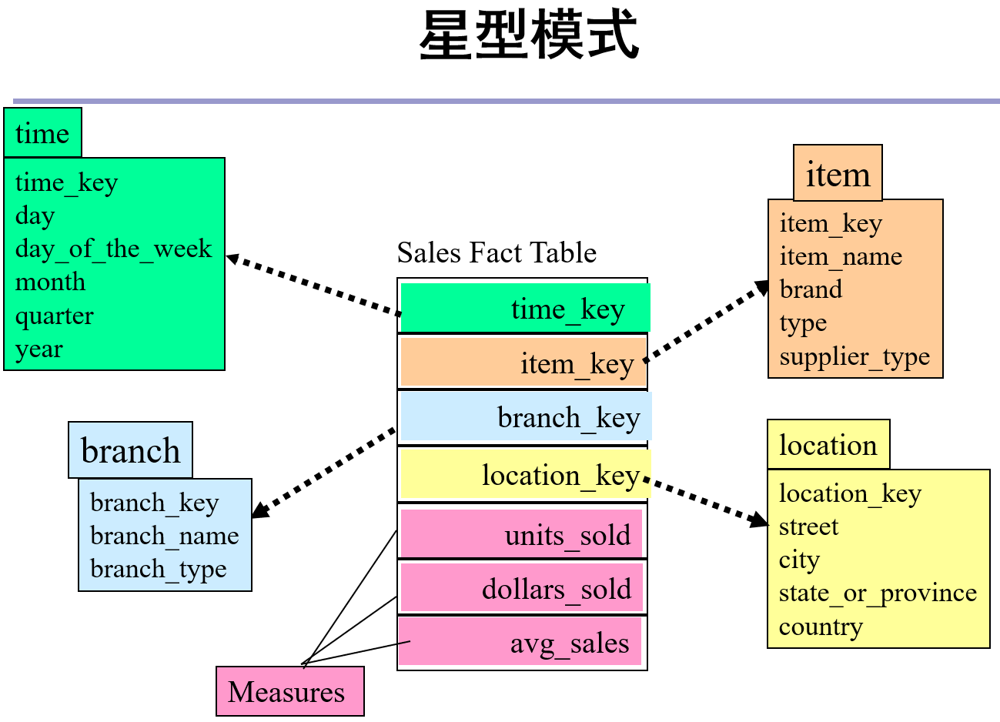
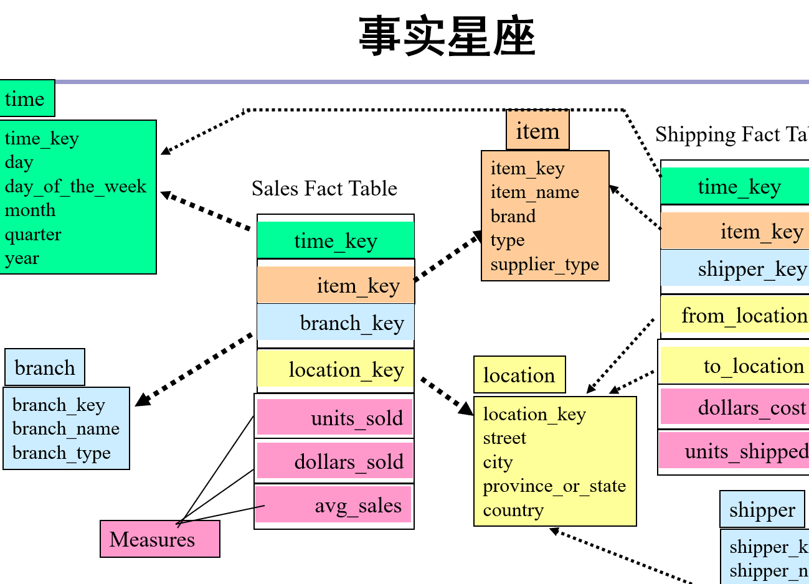
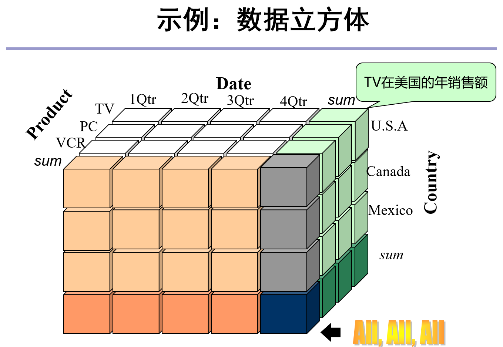

# 数据挖掘

## 数据预处理

### 为什么需要进行预处理?

1. 不完整:收集数据时,不同阶段不同考虑, 人/设备/软件等问题
2. 含噪声:包含错误或孤立点,来源于收集阶段和数据传输阶段
3. 不一致:在名称或代码之间存在差异,来源于不同的数据源 , 功能依赖冲突

> 噪声：错误的数据 
> 孤立点：偏离正常数据，但真实发生

### 数据与处理的主要任务

1. 数据清洗 data cleaning

    填充遗失的数据, 平滑噪声数据, 辨识或删除孤立点 , 解决不一致性问题
2. 数据集成 data integration

    多个数据库, 数据立方或文件进行继承

3. 数据变换 data transformation

    规范化与聚集

4. 数据约简 data reduction

    得到数据集的压缩表示 ,它小得多,但能够产生相同的(或几乎相同的)分析结果

5. 数据离散化 data discretization

    特别对数字值而言非常重要

### 数据清洗

主要任务:

1. 填充遗失数据
2. 辨识孤立点、平滑噪声数据
3. 修正不一致性数据
4. 解决数据集成造成的数据冗余问题

#### 遗失数据

1. 忽略元组:除非有多个属性缺少之,否则该方法不是很有效
2. 人工填充:费事费力
3. 自动填充
    1. 使用全局常量填充,比如"unkonwn" , 但可能会被误认为是一个新的,有意义的类
    2. 该属性的平均值
    3. 使用于给定元素同一类的所有样本该属性的平均值
    4. 使用可能的值:基于推导的方法,比如beyesian公式或决策树

#### 噪声数据

噪声:是一个策略变量中的随机误差或偏差

1. 分箱方法
    1. 先对数据进行排序,然后把他们划分到箱
    2. 通过箱平均值,箱中值等进行平滑

    该方法对神经网络等不适用

    * 等宽划分(距离)

        根据属性值范围划分成N等宽的区间

        很直接,但孤立点将会对此方法有很大的影响

    * 等深划分(频率)

        划分成N个区间,每个区间含有大约相等的样本数

        具有较好的扩展性

2. 聚类

    探测并去除孤立点

3. 计算机和人工检查结合
4. 回归分析

    让数据拟合一个函数来平滑数据

#### 数据集成

数据集成:将多个数据源中的数据结合起来存放在一个一致的数据存储中(如数据仓库)

可能的需要解决问题:

1. 不同数据源可能具有不同的值
2. 不同的表示方式,不同的刻度
3. 数据冗余问题:可以通过相关性分析检测出来

#### 数据变换

1. 平滑 smoothing

    取出噪声数据

2. 聚集 aggregation

    汇总 , 数据立方构造

3. 概化 generalization

    沿概念层次上升

4. 规范化 normalization

    刻度变换

##### 规范化

1. 最大-最小规范化

    $$v' = \frac{v - min}{max_A - min_A}(max_{new} - min_{new}) + min_{new}$$

    移项之后更好理解:

    $$\frac{v' -  min_{new}}{max_{new} - min_{new}} = \frac{v - min}{max_A - min_A}$$

2. z-score 规范化

    $$v' = \frac{v - mean}{stand}$$

    规范化之后 , $v'$满足均值为$0$ , 方差为$1$

3. 小数定标规范化

    $$v' = \frac{v}{10^j}$$

    其中,$j$是使得$max(|v|) < 1$的最下整数

    规范化之后的结果是所有的值都小于1

#### 数据约简

数据约简：两个方向

1. 降维：减少特征

    1. 决策树归纳

        若只需要其中一些属性即可划分数据, 那么只需要保存这些关键属性即可 ,其他属性可约简掉

2. 采样：减少样本数
3. 数值归约：对样本重新编码，值记录模型与统计信息而无需记录原始数据
    1. 参数化方法：比如只记录解析式的参数而不记录所有样本点

        线性回归 , 对数线性模型

    2. 非参数化方法：对于每个区间，只记录平均值与样本数

        直方图 , 聚类 , 采样

降维对时间复杂度减少的幅度不大于减少样本数

#### 离散化

属性的三种类型:

1. 离散
    1. 标称性 : 取自无序集合的值
    2. 有序的 : 取自有序集合的值
2. 连续

离散化:

* 把连续型属性的取值范围划分区间
* 通过离散化减小数据集大小

离散化方法:

1. 分箱
2. 直方图分析
3. 聚类分析
4. 基于熵的离散化(决策树,将样本划分成两个部分,选择信息增益最大的作为划分边界)

## 数据仓库

什么是数据仓库?(必考定义))

数据仓库是面向主题的,集成的,时变的,非易失的数据集合,它用来支持管理部分的决策过程 - W.H.Inmon

1. 联机事物处理 OLTP on-line transaction processing

    日常操作

2. 联机分析处理 OLAP on-line analytical processing

    决策支持

### 建模数据仓库

1. 星型模式

    一个事实与多个直连维表

    

2. 雪花模型

    在星型模式的基础上,维表也存在层次

    

3. 事实星座

    多个事实表分享共同的维表

    

数据仓库一般采用前两种模式(树状,简单 , 而事实星座较为复杂)

### 度量的分类

1. 分布式的 distributive

    一个聚集函数能以分布式进行,称它是分布式的

    比如,min,max,sum,count

2. 代数的 algebraic

    它能由M个参数的代数函数计算 , M是有界的

    如,avg

3. 整体的 holistic

    median(中位数) , mode(众数)

对于代数的和整体的度量,无法采用分布式计算,因此对于常用的部分最好预先计算出来保存

### 数据立方体

数据立方体:在原始数据的基础上, 预先计算更少维度下的综合数据, 以空间换时间

1. 3D 数据立方的白色部分 表示原始数据
2. 2D 数据立方的平面部分
3. 1D 数据立方的灰色竖条
4. 0D 数据立方的最深色部分 表示所有数据的总和

### OLAP的操作

1. 上卷 Roll up(drill up)

    通过一个维度的概念分层向上攀升或通过维度归约,在数据立方体上进行聚集

2. 下钻 drill down

    上卷的你操作

3. 切片 Slice 和 切块 dice

    投影与选择

4. 转轴 pivot (rotate)

    是一种目视操作,它转动数据的视角,提供数据的替代表示

### 3个数据仓库模型

1. 企业仓库
2. 数据集市
3. 虚拟仓库