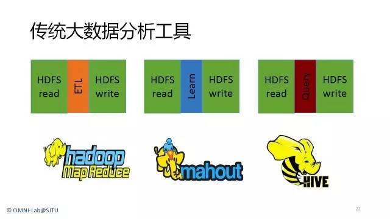
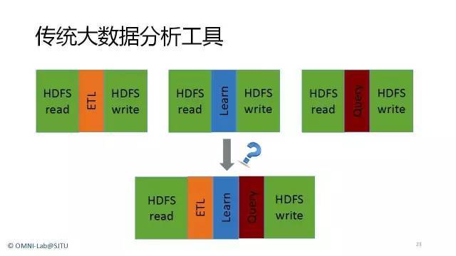
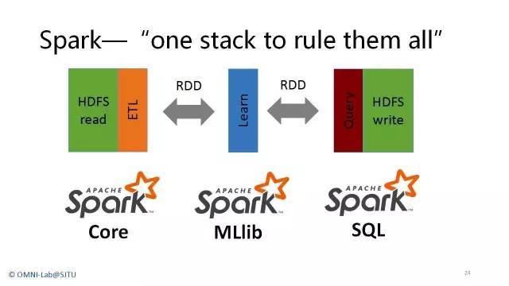
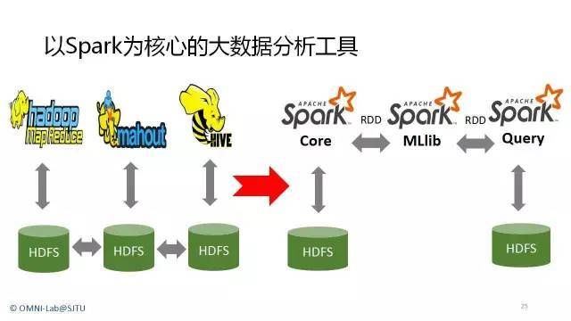
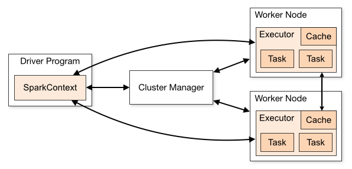
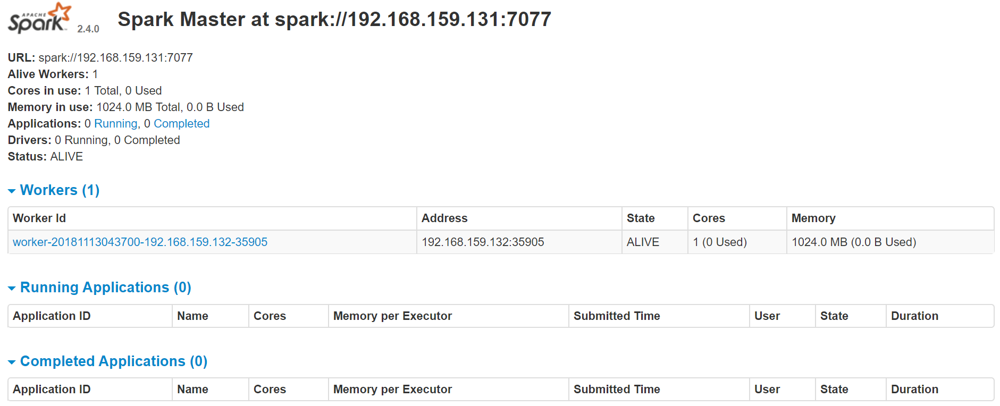
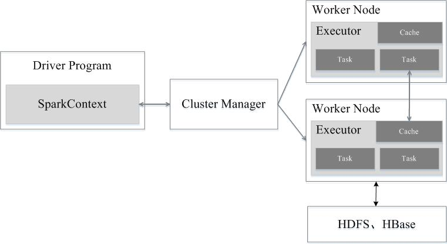
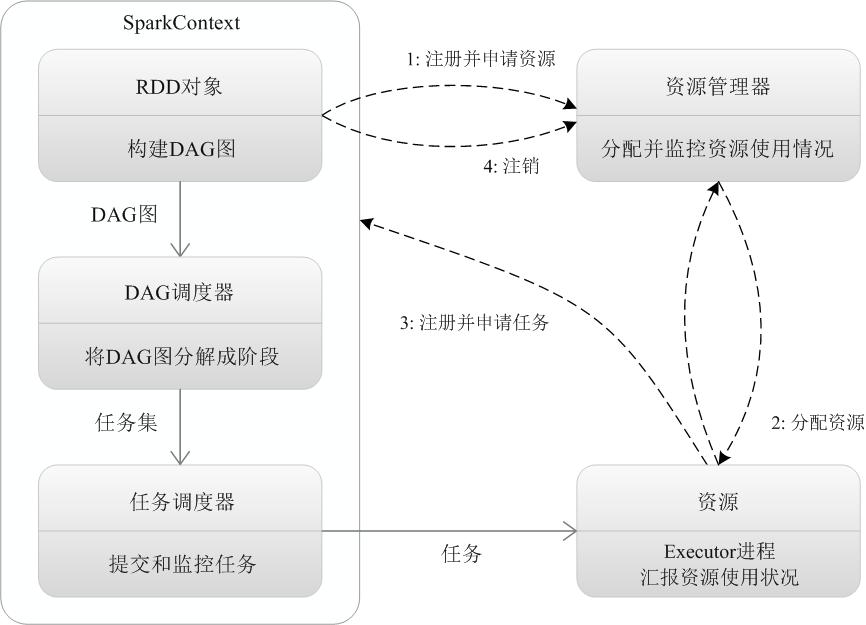
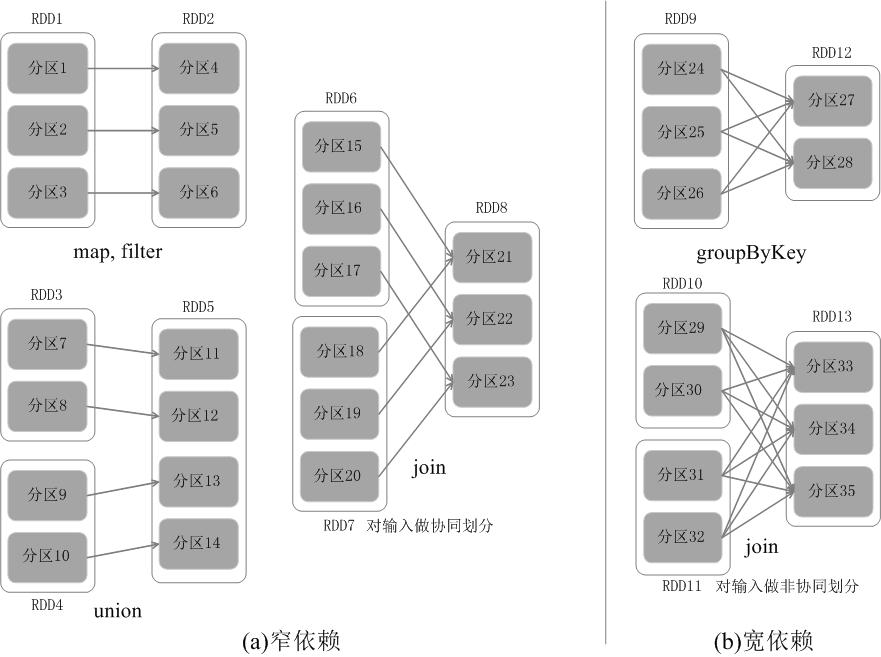
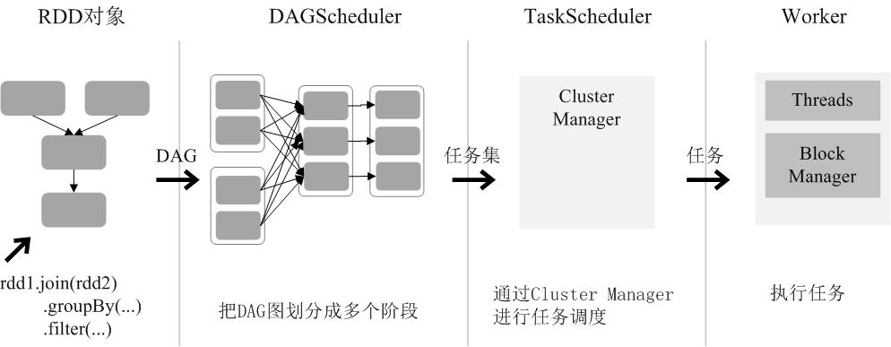

# spark

Spark具有如下几个主要特点：

- 运行速度快：Spark使用先进的DAG（Directed Acyclic Graph, 有向无环图）执行引擎, 以支持循环数据流与内存计算, 基于内存的执行速度可比Hadoop MapReduce快上百倍, 基于磁盘的执行速度也能快十倍；
- 容易使用：Spark支持使用Scala、Java、Python和R语言进行编程, 简洁的API设计有助于用户轻松构建并行程序, 并且可以通过Spark Shell进行交互式编程；
- 通用性：Spark提供了完整而强大的技术栈, 包括SQL查询、流式计算、机器学习和图算法组件, 这些组件可以无缝整合在同一个应用中, 足以应对复杂的计算；
- 运行模式多样：Spark可运行于独立的集群模式中, 或者运行于Hadoop中, 也可运行于Amazon EC2等云环境中, 并且可以访问HDFS、Cassandra、HBase、Hive等多种数据源。

---

Spark相对于Hadoop的优势:
Hadoop虽然已成为大数据技术的事实标准, 但其本身还存在诸多缺陷, 最主要的缺陷是其MapReduce计算模型延迟过高, 无法胜任实时、快速计算的需求, 因而只适用于离线批处理的应用场景。

回顾Hadoop的工作流程, 可以发现Hadoop存在如下一些缺点：

- 表达能力有限。计算都必须要转化成Map和Reduce两个操作, 但这并不适合所有的情况, 难以描述复杂的数据处理过程；
- 磁盘IO开销大。每次执行时都需要从磁盘读取数据, 并且在计算完成后需要将中间结果写入到磁盘中, IO开销较大；
- 延迟高。一次计算可能需要分解成一系列按顺序执行的MapReduce任务, 任务之间的衔接由于涉及到IO开销, 会产生较高延迟。而且, 在前一个任务执行完成之前, 其他任务无法开始, 难以胜任复杂、多阶段的计算任务。

Spark在借鉴Hadoop MapReduce优点的同时, 很好地解决了MapReduce所面临的问题。相比于MapReduce, Spark主要具有如下优点：

- Spark的计算模式也属于MapReduce, 但不局限于Map和Reduce操作, 还提供了种数据集操作类型, 编程模型比MapReduce更灵活；
- Spark提供了内存计算, 中间结果直接放到内存中, 带来了更高的迭代运算效率；
- Spark基于DAG的任务调度执行机制, 要优于MapReduce的迭代执行机制。

Spark最大的特点就是将计算数据、中间结果都存储在内存中, 大大减少了IO开销, 因而, Spark更适合于迭代运算比较多的数据挖掘与机器学习运算。

Spark并不能完全替代Hadoop, 主要用于替代Hadoop中的MapReduce计算模型。实际上, Spark已经很好地融入了Hadoop生态圈, 并成为其中的重要一员, 它可以借助于YARN实现资源调度管理, 借助于HDFS实现分布式存储。

此外, Hadoop可以使用廉价的、异构的机器来做分布式存储与计算, 但是, Spark对硬件的要求稍高一些, 对内存与CPU有一定的要求。

---

为什么 Spark?






在实际应用中, 大数据处理主要包括以下三个类型：

- 复杂的批量数据处理：时间跨度通常在数十分钟到数小时之间；
- 基于历史数据的交互式查询：时间跨度通常在数十秒到数分钟之间；
- 基于实时数据流的数据处理：时间跨度通常在数百毫秒到数秒之间。

目前已有很多相对成熟的开源软件用于处理以上三种情景, 比如, 可以利用Hadoop MapReduce来进行批量数据处理, 可以用Impala来进行交互式查询（Impala与Hive相似, 但底层引擎不同, 提供了实时交互式SQL查询）, 对于流式数据处理可以采用开源流计算框架Storm。一些企业可能只会涉及其中部分应用场景, 只需部署相应软件即可满足业务需求, 但是, 对于互联网公司而言, 通常会同时存在以上三种场景, 就需要同时部署三种不同的软件, 这样做难免会带来一些问题：

- 不同场景之间输入输出数据无法做到无缝共享, 通常需要进行数据格式的转换；
- 不同的软件需要不同的开发和维护团队, 带来了较高的使用成本；
- 比较难以对同一个集群中的各个系统进行统一的资源协调和分配。

Spark的设计遵循"一个软件栈满足不同应用场景"的理念, 逐渐形成了一套完整的生态系统, 既能够提供内存计算框架, 也可以支持SQL即席查询、实时流式计算、机器学习和图计算等

---

## 下载

- 下载: [Downloads | Apache Spark](https://spark.apache.org/downloads.html)

- 解压
    ```bash
     tar -xf ./spark-2.4.0-bin-hadoop2.7.tgz
     cd spark-2.4.0-bin-hadoop2.7/
    ```

---

## 运行

```bash
./bin/spark-shell --master local[2]
```

`--master` 表示需要连接的 `master` 节点, `local` 表示本地, `[2]` 表示2个县城

```bash
./bin/spark-submit examples/src/main/python/pi.py 10
```

---

## 在集群上部署 spark



集群类型:

- Standalone
- Apache Mesos
- Hadoop YARN
- Kubernetes

---

### Standalone

启动 master
(需要配置`spark-env.h`, 否则会被当做 `local` 执行, 导致 worker 无法连接到 master):

```bash
echo SPARK_MASTER_HOST=192.168.159.131 > ./conf/spark-env.sh
./sbin/start-master.sh
```

或者 需要 `conf/slaves`?
> To launch a Spark standalone cluster with the launch scripts, you should create a file called conf/slaves in your Spark directory, which must contain the hostnames of all the machines where you intend to start Spark workers, one per line.
> If conf/slaves does not exist, the launch scripts defaults to a single machine (localhost)

`192.168.159.131` 是 master 所在主机的 ip

---

启动 worker

```bash
./sbin/start-slave.sh spark://192.168.159.131:7077
```

访问 Web UI: [http://localhost:8080]



---

连接一个应用到spark集群:

```bash
./bin/spark-shell --master spark://192.168.159.131:7077
```


---

## 运行架构

基本概念:

- RDD：是弹性分布式数据集（ Resilient Distributed Dataset ）的简称, 是分布式内存的一个抽象概念, 提供了一种高度受限的共享内存模型；
- DAG：是Directed Acyclic Graph（有向无环图）的简称, 反映RDD之间的依-；
- Executor：是运行在工作节点（Worker Node）上的一个进程, 负责运行任务, 并为应用程序存储数据；
- 应用：用户编写的Spark应用程序；
- 任务：运行在Executor上的工作单元；
- 作业：一个作业包含多个RDD及作用于相应RDD上的各种操作；
- 阶段：是作业的基本调度单位, 一个作业会分为多组任务, 每组任务被称为"阶段", 或者也被称为"任务集"。

---

运行架构:

- 集群资源管理器（Cluster Manager）
    集群资源管理器可以是Spark自带的资源管理器, 也可以是YARN或Mesos等资源管理框架。
- 运行作业任务的工作节点（Worker Node）
- 每个应用的任务控制节点（Driver）
- 每个工作节点上负责具体任务的执行进程（Executor）



> 与Hadoop MapReduce计算框架相比, Spark所采用的Executor有两个优点：一是利用多线程来执行具体的任务（Hadoop MapReduce采用的是进程模型）, 减少任务的启动开销；二是Executor中有一个BlockManager存储模块, 会将内存和磁盘共同作为存储设备, 当需要多轮迭代计算时, 可以将中间结果存储到这个存储模块里, 下次需要时, 就可以直接读该存储模块里的数据, 而不需要读写到HDFS等文件系统里, 因而有效减少了IO开销；或者在交互式查询场景下, 预先将表缓存到该存储系统上, 从而可以提高读写IO性能。

---

Spark运行基本流程

1. 提交 spark 应用
2. Driver 创建 SparkContext
    由SparkContext负责和资源管理器（Cluster Manager）的通信以及进行资源的申请、任务的分配和监控等
3. 资源管理器为Executor分配资源, 并启动Executor进程, Executor运行情况将随着"心跳"发送到资源管理器上
4. SparkContext根据RDD的依赖关系构建DAG图, DAG图提交给DAG调度器（DAGScheduler）进行解析, 将DAG图分解成多个"阶段"（每个阶段都是一个任务集）, 并且计算出各个阶段之间的依赖关系, 然后把一个个"任务集"提交给底层的任务调度器（TaskScheduler）进行处理；
5. Executor向SparkContext申请任务, 任务调度器将任务分发给Executor运行, 同时, SparkContext将应用程序代码发放给Executor；
6. 任务在Executor上运行, 把执行结果反馈给任务调度器, 然后反馈给DAG调度器, 运行完毕后写入数据并释放所有资源。



---

## RDD的设计与运行原理

### 背景

不同计算阶段之间会重用中间结果, 即一个阶段的输出结果会作为下一个阶段的输入, 不同RDD之间的转换操作形成依赖关系，可以实现管道化，从而避免了中间结果的存储，大大降低了数据复制、磁盘IO和序列化开销

一个RDD就是一个分布式对象集合，本质上是一个**只读**的分区记录集合，每个RDD可以分成多个分区，每个分区就是一个数据集片段，并且一个RDD的**不同分区可以被保存到集群中不同的节点**上，从而可以在集群中的不同节点上进行并行计算

RDD提供了一组丰富的操作以支持常见的数据运算，分为“行动”（Action）和“转换”（Transformation）两种类型, 前者用于执行计算并指定输出的形式，后者指定RDD之间的相互依赖关系
两类操作的主要区别是，转换操作（比如map、filter、groupBy、join等）接受RDD并返回RDD，而行动操作（比如count、collect等）接受RDD但是返回非RDD（即输出一个值或结果）


---

启动 spark 交互环境:

```bash
PYSPARK_PYTHON=python3 ./bin/pyspark
```

输入以下代码:
```python
fileRDD = sc.textFile('hdfs://localhost:9000/test.txt') #创建RDD
def contains(line):
    return 'hello world' in line
filterRDD = fileRDD.filter(contains)    #转换, 得到新的RDD, 此时只是构建了 DAG, 还未执行
filterRDD.cache()   # 对filterRDD进行持久化，把它保存在内存(cache())或磁盘中，方便后续重复使用
filterRDD.count()   # count()是一个行动操作，用于计算一个RDD集合中包含的元素个数
```

---

### RDD之间的依赖关系

RDD中的依赖关系分为窄依赖（Narrow Dependency）与宽依赖（Wide Dependency）

窄依赖: 一个父分区对应一个子分区(map, union, filter)
宽依赖: 一个父分区对应多个子分区(groupByKey, sortByKey)



对于窄依赖的RDD，可以以流水线的方式计算所有父分区，不会造成网络之间的数据混合。对于宽依赖的RDD，则通常伴随着Shuffle操作，即首先需要计算好所有父分区数据，然后在节点之间进行Shuffle

---

### 阶段划分

具体划分方法是：在DAG中进行反向解析，遇到宽依赖就断开，遇到窄依赖就把当前的RDD加入到当前的阶段中；将窄依赖尽量划分在同一个阶段中，可以实现流水线计算

### RDD执行过程



## 参考

- [运用Spark进行交通数据案例分析：大型活动大规模人群的检测与疏散 - 云+社区 - 腾讯云](https://cloud.tencent.com/developer/article/1059262)
- [常见的七种Hadoop和Spark项目案例-博客-云栖社区-阿里云](https://yq.aliyun.com/articles/603785?utm_content=m_1000003940)
- [Overview - Spark 2.4.0 Documentation](http://spark.apache.org/docs/latest/index.html)
- [子雨大数据之Spark入门教程(Python版)_厦大数据库实验室博客](http://dblab.xmu.edu.cn/blog/1709-2/)
