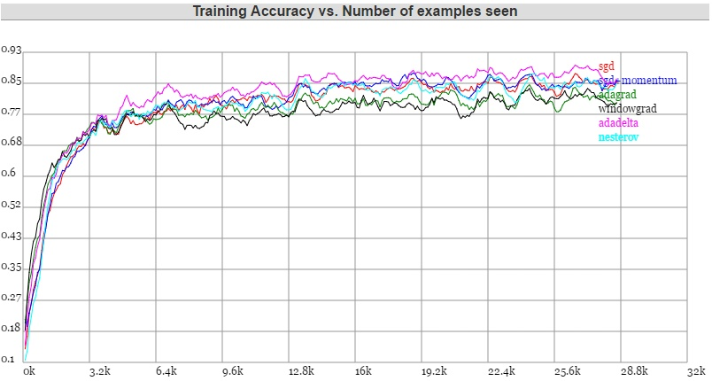

)

# 深度学习最全优化方法总结比较（SGD，Adagrad，Adadelta，Adam，Adamax，Nadam）

[ycszen](https://www.zhihu.com/people/yu-chang-qian)

From : [深度学习最全优化方法总结比较（SGD，Adagrad，Adadelta，Adam，Adamax，Nadam）](https://zhuanlan.zhihu.com/p/22252270)

## 前言

（标题不能再中二了）本文仅对一些常见的优化方法进行直观介绍和简单的比较，各种优化方法的详细内容及公式只好去认真啃论文了，在此我就不赘述了。

## SGD

此处的SGD指mini-batch gradient descent，关于batch gradient descent, stochastic gradient descent, 以及 mini-batch gradient
descent的具体区别就不细说了。现在的SGD一般都指mini-batch gradient descent。

SGD就是每一次迭代计算mini-batch的梯度，然后对参数进行更新，是最常见的优化方法了。即：

  

其中，是学习率，是梯度SGD完全依赖于当前batch的梯度，所以可理解为允许当前batch的梯度多大程度影响参数更新

**缺点**：（正因为有这些缺点才让这么多大神发展出了后续的各种算法）

  - 选择合适的learning rate比较困难 - 对所有的参数更新使用同样的learning
    rate。对于稀疏数据或者特征，有时我们可能想更新快一些对于不经常出现的特征，对于常出现的特征更新慢一些，这时候SGD就不太能满足要求了

  - SGD容易收敛到局部最优，并且在某些情况下可能被困在鞍点【原来写的是“容易困于鞍点”，经查阅论文发现，其实在合适的初始化和step
    size的情况下，鞍点的影响并没这么大。感谢@[冰橙](https://www.zhihu.com/people/meliorare)的指正】

## Momentum

momentum是模拟物理里动量的概念，积累之前的动量来替代真正的梯度。公式如下：

其中，是动量因子

**特点：**

  - 下降初期时，使用上一次参数更新，下降方向一致，乘上较大的能够进行很好的加速
  - 下降中后期时，在局部最小值来回震荡的时候，，使得更新幅度增大，跳出陷阱
  - 在梯度改变方向的时候，能够减少更新
    总而言之，momentum项能够在相关方向加速SGD，抑制振荡，从而加快收敛

## Nesterov

nesterov项在梯度更新时做一个校正，避免前进太快，同时提高灵敏度。
将上一节中的公式展开可得：

可以看出，并没有直接改变当前梯度，所以Nesterov的改进就是让之前的动量直接影响当前的动量。即：

所以，加上nesterov项后，梯度在大的跳跃后，进行计算对当前梯度进行校正。如下图：

momentum首先计算一个梯度(短的蓝色向量)，然后在加速更新梯度的方向进行一个大的跳跃(长的蓝色向量)，nesterov项首先在之前加速的梯度方向进行一个大的跳跃(棕色向量)，计算梯度然后进行校正(绿色梯向量)

其实，momentum项和nesterov项都是为了使梯度更新更加灵活，对不同情况有针对性。但是，人工设置一些学习率总还是有些生硬，接下来介绍几种自适应学习率的方法

## Adagrad

Adagrad其实是对学习率进行了一个约束。即：

此处，对从1到进行一个递推形成一个约束项regularizer，，用来保证分母非0

**特点：**

  - 前期较小的时候，
    regularizer较大，能够放大梯度
  - 后期较大的时候，regularizer较小，能够约束梯度
  - 适合处理稀疏梯度

**缺点：**

  - 由公式可以看出，仍依赖于人工设置一个全局学习率
  - 设置过大的话，会使regularizer过于敏感，对梯度的调节太大
  - 中后期，分母上梯度平方的累加将会越来越大，使，使得训练提前结束

## Adadelta

Adadelta是对Adagrad的扩展，最初方案依然是对学习率进行自适应约束，但是进行了计算上的简化。
Adagrad会累加之前所有的梯度平方，而Adadelta只累加固定大小的项，并且也不直接存储这些项，仅仅是近似计算对应的平均值。即：

  

在此处Adadelta其实还是依赖于全局学习率的，但是作者做了一定处理，经过近似牛顿迭代法之后：

其中，代表求期望。

此时，可以看出Adadelta已经不用依赖于全局学习率了。

**特点：**

  - 训练初中期，加速效果不错，很快
  - 训练后期，反复在局部最小值附近抖动

## RMSprop

RMSprop可以算作Adadelta的一个特例：

当时，就变为了求梯度平方和的平均数。

如果再求根的话，就变成了RMS(均方根)：

此时，这个RMS就可以作为学习率的一个约束：

**特点：**

  - 其实RMSprop依然依赖于全局学习率
  - RMSprop算是Adagrad的一种发展，和Adadelta的变体，效果趋于二者之间
  - 适合处理非平稳目标 - 对于RNN效果很好

## Adam

Adam(Adaptive Moment
Estimation)本质上是带有动量项的RMSprop，它利用梯度的一阶矩估计和二阶矩估计动态调整每个参数的学习率。Adam的优点主要在于经过偏置校正后，每一次迭代学习率都有个确定范围，使得参数比较平稳。公式如下：

其中，，分别是对梯度的一阶矩估计和二阶矩估计，可以看作对期望，的估计；，是对，的校正，这样可以近似为对期望的无偏估计。
可以看出，直接对梯度的矩估计对内存没有额外的要求，而且可以根据梯度进行动态调整，而对学习率形成一个动态约束，而且有明确的范围。

**特点：**

  - 结合了Adagrad善于处理稀疏梯度和RMSprop善于处理非平稳目标的优点
  - 对内存需求较小
  - 为不同的参数计算不同的自适应学习率
  - 也适用于大多非凸优化 -
适用于大数据集和高维空间

## Adamax

Adamax是Adam的一种变体，此方法对学习率的上限提供了一个更简单的范围。公式上的变化如下：

可以看出，Adamax学习率的边界范围更简单

## Nadam

Nadam类似于带有Nesterov动量项的Adam。公式如下：

可以看出，Nadam对学习率有了更强的约束，同时对梯度的更新也有更直接的影响。一般而言，在想使用带动量的RMSprop，或者Adam的地方，大多可以使用Nadam取得更好的效果。

## 经验之谈

  - 对于稀疏数据，尽量使用学习率可自适应的优化方法，不用手动调节，而且最好采用默认值
  - SGD通常训练时间更长，但是在好的初始化和学习率调度方案的情况下，结果更可靠
  - 如果在意更快的收敛，并且需要训练较深较复杂的网络时，推荐使用学习率自适应的优化方法。
  - Adadelta，RMSprop，Adam是比较相近的算法，在相似的情况下表现差不多。
  - 在想使用带动量的RMSprop，或者Adam的地方，大多可以使用Nadam取得更好的效果 

最后展示两张可厉害的图，一切尽在图中啊，上面的都没啥用了...
...

损失平面等高线

在鞍点处的比较

**转载须全文转载且注明作者和原文链接，否则保留维权权利**  

## 引用

[Adagrad](http://link.zhihu.com/?target=http%3A//www.jmlr.org/papers/volume12/duchi11a/duchi11a.pdf)
[RMSprop Lecture 6e](http://link.zhihu.com/?target=http%3A//www.cs.toronto.edu/%7Etijmen/csc321/lecture_notes.shtml)
[Adadelta](http://link.zhihu.com/?target=http%3A//arxiv.org/abs/1212.5701)
[Adam](http://link.zhihu.com/?target=http%3A//arxiv.org/abs/1412.6980v8)
[Nadam](http://link.zhihu.com/?target=http%3A//cs229.stanford.edu/proj2015/054_report.pdf)
[On the importance of initialization and momentum in deep
learning](http://link.zhihu.com/?target=http%3A//www.cs.toronto.edu/%7Efritz/absps/momentum.pdf)
[Keras](http://link.zhihu.com/?target=https%3A//keras.io/optimizers/)[中文文档](http://link.zhihu.com/?target=http%3A//keras-cn.readthedocs.io/en/latest/)
[Alec
Radford](http://link.zhihu.com/?target=https%3A//twitter.com/alecrad)(图)
[An overview of gradient descent optimization
algorithms](http://link.zhihu.com/?target=http%3A//sebastianruder.com/optimizing-gradient-descent/)
[Gradient Descent Only Converges to
Minimizers](http://link.zhihu.com/?target=http%3A//www.jmlr.org/proceedings/papers/v49/lee16.pdf)
[Deep
Learning:Nature](http://link.zhihu.com/?target=http%3A//www.nature.com/nature/journal/v521/n7553/abs/nature14539.html)
